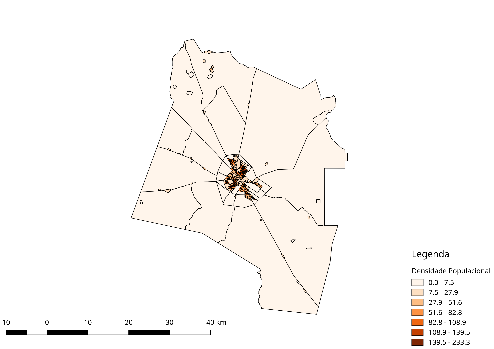

# QGIS: Mapa de densidade populacional

<!--- Alguns exemplos. Veja https://shields.io para outros escudos customizavéis. Convém incluir dependências, status do projeto e informações da licença aqui --->


QGIS: Mapa de densidade populacional é um `exemplo` que apresenta um rápido `tutorial` de como fazer um `mapa de densidade populacional` utilizando o QGIS com os dados do institudo brasileiro de geografia e estatística (IBGE).

Através do IBGE juntamente com o QGIS é possível criar diversos mapas. Nesse projeto será criado um mapa de densidade populacional da cidade Mossoró/RN, mas você pode selecionar outro município que melhor atenda sua necessidade.
Também é possível acessar esse e outros mapas nos seguintes portais:

* [https://portaldemapas.ibge.gov.br/portal.php#homepage](https://portaldemapas.ibge.gov.br/portal.php#homepage)
* [https://censo2010.ibge.gov.br/sinopseporsetores/?nivel=st](https://censo2010.ibge.gov.br/sinopseporsetores/?nivel=st)

## Movicação

Resolvi fazer esse pequeno tutorial depois da necessidade que tive durante o exame de seleção para o mestrado em ciência da computação.
Depois do sufoco resolvi documentar todo o passo a passo, pois acredito que ele ainda me será bastante útil.

## Pré-requisitos

Antes de começar, verifique se você atendeu aos seguintes requisitos:
* Você instalou o [QGIS](https://qgis.org/pt_BR/site/)?

## Instalando <qgis-mapa-de-densidade-populacional>

Para instalar o <qgis-mapa-de-densidade-populacional>, siga estes passos:

```shell
git clone https://github.com/HerlanAssis/qgis-mapa-de-densidade-populacional
```

## Utilizando <qgis-mapa-de-densidade-populacional>

Para obtermos as imagens que desejamos, é necessário realizar realizar duas etapas:
* 1ª etapa baixar os dados necessários;
* 2ª criar as imagens utilizando o QGIS;

### 1ª Etapa: Download de arquivos
A primeira etapa será dividia em alguns passos. Para ambos os passos é necessário acessar o site do [IBGE](https://www.ibge.gov.br/).

#### 1º Passo: Download dos setores sensitários
* Acesse o site principal do IBGE;
* Vá até a aba `Geociências` e clique em download;
* Depois baixe o seguinte arquivo:

```
organizacao_do_territorio
│   ...    
└───malhas_territorias
    │   ...    
    └───malhas_de_setores_censitarios__divisoes_intramunicipais        
        │   ...
        └───censo_2010
            │   ...
            └───setores_sensitarios_shp
                │   ...
                └───rn
                    │   rn_setores_sensitarios.zip                   
```

#### 2º Passo: Download dos dados populacionais
* Acesse o site principal do IBGE;
* Vá até a aba `Estatísticas` e clique em download;
* Depois baixe o seguinte arquivo:

```
Censos
│   ...    
└───Censo_demografico_2010
    │   ...    
    └───Resultados_do_universo        
        │   ...
        └───Agregados_por_setores_sensitarios                        
            │   RN_20171016.zip                
```

### 2ª Etapa: Criação das imagens
Essa etapa consiste em construir as imagens a partir dos dados obtidos do IBGE.

#### 1º Passo: Seleção dos setores censitários
* Abra o QGIS;
* Arraste o arquivo `.shp` para dentro do software;
* Depos vá em: `Camadas -> Filtrar -> Fornecedor de expressão de filtragem específica` e digite: "CD_GEOCODM" = '2408003'.

Obs: O código do município de Mossoró/RN é 2408003. Caso queira descobrir o código do seu município acesse: [https://www.ibge.gov.br/explica/codigos-dos-municipios.php](https://www.ibge.gov.br/explica/codigos-dos-municipios.php).

Feito isso, clique com o botão direito do mouse na camada e selecione `Salvar como` e nomeie o arquivo conforme desejado.
Neste exemplo o arquivo foi nomeado como `setores_censitarios_rn_mossoro`. Antes de salvar é necessário selecionar o sistema de projeção, no nosso caso é UTM 24s, para identificar o seu acesse: [https://mangomap.com/robertyoung/maps/69585/what-utm-zone-am-i-in-#](https://mangomap.com/robertyoung/maps/69585/what-utm-zone-am-i-in-#).
Uma vez identificado o UTM, clique no `ícone do globo` no campo `SRC`, pesquise o sistema identificado e selecione-o e salve o arquivo.

Obs: Lembre-se sempre de atualizar o `SRC` global do QGIS.

#### 2º Passo: Seleção dos dados censitários

Antes de tudo, descompacte o arquivo `RN_20171016.zip`.

Para calcular a densidade popuçacional precisaremos identificar os `Moradores em domicílios particulares permanentes ou população residente em domicílios particulares permanentes`. Essas informações estão presentes nas planilhas baixadas no segundo passo da primeira etapa.
Para identificarmos a planilha que será utilizada assim como a sua coluna, basta consultar o arquivo [Base de informações do Censo Demográfico 2010: Resultados do Universo por setor censitário](http://www.ipea.gov.br/redeipea/images/pdfs/base_de_informacoess_por_setor_censitario_universo_censo_2010.pdf).
Após consultar o arquivo acima, podemos observar que iremos utilizar planilha `Basico.csv` e dela a coluna `v002`.

Agora precisaremos fazer a `união` da `camada` com os `dados da planilha`, para fazer isso siga os seguintes passos:
* Arraste a planilha `Basico.csv` para o QGIS;
* Arraste o arquivo (caso ele ainda não esteja lá) `setores_censitarios_rn_mossoro` para o QGIS;
* Clique com o botão direito do mouse na camada `setores_censitarios_rn_mossoro` e acesse `propriedades -> Uniões -> adicionar (símbolo do '+')`. Na label unir campo selecione `Cod_setor`, na label campo alvo selecione `CD_GEOCODI`. Depois marque a caixa de texto `Prefixo do nome do campo personalizado` e limpe o texto presente nela.
* Clique com o botão direito do mouse na camada e selecione `Salvar como`, no nosso exemplo iremos salvar essa nova camada com o nome `setores_censitarios_rn_mossoro_basico`.
* Remova as demais camadas.

#### 3º Passo: Calcular a densidade populacional

Para calcular a densidade populacional precisaremos calcular dois campos em cada setor censitário, são eles: `área em metros quadrados` e `área em hectares`.

Para calcuar a area em metros quadrados faça:
* Clique no ícone `calculadora de campo`/`calculadora de atributo`;
* Nomeie o novo campo com `area_m2`;
* Selecione o tipo do campo como `número decimal (real)`;
* Digite `$area` no campo de `Expressão`;
* Clique em `Ok` e depois em `salvar edições na camada` (ícone do lápis com o disquete);

Para calcuar a area em hectares faça:
* Clique no ícone `calculadora de campo`/`calculadora de atributo`;
* Nomeie o novo campo com `area_ha`;
* Selecione o tipo do campo como `número decimal (real)`;
* Digite `"area_m2"/10000"` no campo de `Expressão`;
* Clique em `Ok` e depois em `salvar edições na camada` (ícone do lápis com o disquete);

Agora podemos obter o cálculo da densidade populacional por setor.

Para calcuar a densidade faça:
* Clique no ícone `calculadora de campo`/`calculadora de atributo`;
* Nomeie o novo campo com `dens_ha`;
* Selecione o tipo do campo como `número decimal (real)`;
* Digite `"V002"/"area_ha"` no campo de `Expressão`;
* Clique em `Ok` e depois em `salvar edições na camada` (ícone do lápis com o disquete);

Feito isso, salve o arquivo como `setores_censitarios_rn_mossoro_basico_dens` e remova as demais camadas.

#### 4º Passo: Geração do mapa

* Clique com o botão direito na camada `setores_censitarios_rn_mossoro_basico_dens` e vá em `propriedades`;
* Vá em `estilo`;
* Selecione a label `Simbolo simples` e altere para graduado;
* Selecione a coluna `dens_ha`;
* Selecione o intervalo de cor que você preferir, nesse caso foi selecionados os tons de laranja;
* Selecione o total de 7 classes ou o total que for desejado;
* Mude para o `Modo` para `Quantil (contagem igual)`;
* Clique em `Ok`;

Ao final, iremos obter a seguinte figura:


## TODO

As próximas ações para o <qgis-mapa-de-densidade-populacional> são:

* [x] ~~Escrever README~~
* [ ] Escrever um artigo sobre o tema.

## Quer adjudar:

Para ajudar com <qgis-mapa-de-densidade-populacional>, você pode reportar [erros](https://github.com/HerlanAssis/qgis-mapa-de-densidade-populacional/issues/new) caso ache necessário.

## Contato

Se você quiser entrar em contato comigo, entre em contato com herlanassis@gmail.com.

## Notas
Todos os arquivos necessários durante o projeto estão divididos nas seguntes estruturas:

```
<etapa>
│   ...    
└───<passo>
    │   <arquivo>            
```

Obrigado!